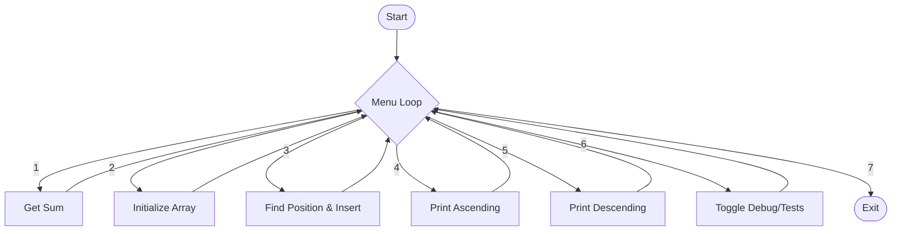

# Array Search & Adaptive Insertion

A study project focused on efficient data structure manipulation and algorithm analysis. This program maintains a sorted dataset and allows for "adaptive" insertion, ensuring the array remains sorted without needing a full re-sort.

## ✨ Features

- **Dynamic Array Construction**: Build initial datasets of up to 10,000,000 elements.
- **Adaptive Insertion Algorithm**: Automatically selects **linear search** ($O(n)$) for arrays under 100 elements or **binary search** ($O(\log n)$) for larger ones, then inserts at the correct position.
- **Dual Perspective Display**: View data in both ascending (standard) and descending (reversed) order.
- **Integrated Debug Suite**: Toggle trace logs to visualize pointer movement and performance timing.
- **Automated Testing**: Built-in test cases for verifying edge cases like empty arrays, single elements, and extreme values.

## 🛠️ Technical Stack

- **Language**: Python 3.x
- **Core Modules**: `time` (benchmarking), `ast` (safe literal evaluation for tests), `sys` (process control).

## 🚀 Getting Started

1. **Clone/Download** the repository.
2. **Run the engine**:
   ```bash
   python engine.py
   ```
3. **Menu Flow**:
   - `1`: Calculate the sum of all elements.
   - `2`: Initialize the array.
   - `3`: Insert a new value using adaptive search.
   - `4/5`: Inspect the data (Ascending/Descending).
   - `6`: Enable TRACE mode for performance metrics and run unit tests.

## 📊 Technical Analysis

### Logic Flow
The following diagram illustrates the program's main execution loop:



### Algorithm Complexity (Big O)

| Operation | Complexity | Notes |
| :--- | :--- | :--- |
| **Get Sum** | $O(n)$ | Iterative summation of all elements. |
| **Search (linear)** | $O(n)$ | Used when array size < `SEARCH_THRESHOLD` (100). |
| **Search (binary)** | $O(\log n)$ | Used when array size ≥ `SEARCH_THRESHOLD` (100). |
| **Insertion** | $O(n)$ | Shifting elements in a Python list. |
| **Reversing** | $O(n)$ | Creating a reversed slice of the list. |

## 🧪 Development History
This project evolved through four phases of study:
1. **Foundation**: Implementing basic array building and position finding.
2. **Structural Design**: Moving from linear scripts to a robust dispatch-style menu system.
3. **Optimization & Testing**: Adding performance timing and automated case verification.
4. **Statistical Enhancements**: Added summation and improved test coverage.
5. **Algorithm Selection**: Added `binary_search` and a `search_data` dispatcher that auto-selects linear or binary search based on array size.
